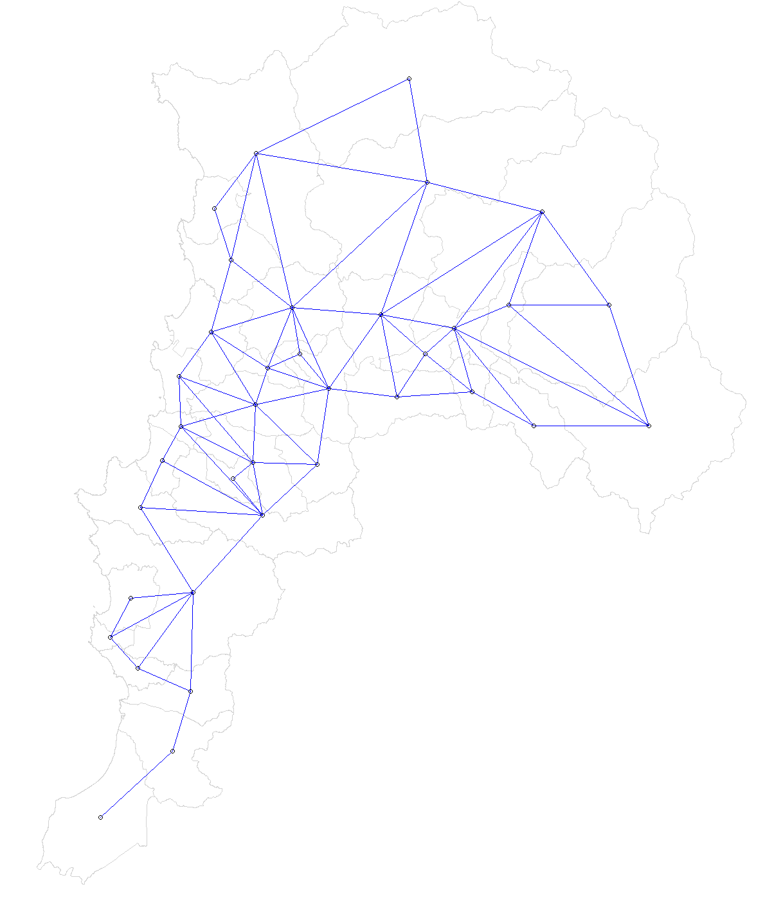

```{=html}
<style>
.leaflet {
    margin: auto;
}
</style>
```
```{=html}
<style type="text/css">

h1.title {
  font-size: 30px;
  color: DarkRed;
  text-align: center;
}
h4.author { /* Header 4 - and the author and data headers use this too  */
    font-size: 16px;
  font-family: "Times New Roman", Times, serif;
  color: Black;
  text-align: center;
}
h4.date { /* Header 4 - and the author and data headers use this too  */
  font-size: 16px;
  font-family: "Times New Roman", Times, serif;
  color: Black;
  text-align: center;
}
</style>
```
```{=html}
<style type="text/css">
  body{
  font-family: Helvetica;
  font-size: 12pt;
}
</style>
```
```{r setup, include=FALSE}
knitr::opts_chunk$set(echo = TRUE)
fig.align='center'
library(DT)
library(xaringanExtra)
xaringanExtra::use_panelset()
xaringanExtra::style_panelset_tabs(font_family = "inherit")
library(readxl)
library(dplyr)
library(stringi)
library(ggmap) 
library(lubridate)
library(tidyr)
library(readr)
library(openxlsx)
library(geodata)
library(sp)
library(stringr)
library(RColorBrewer)
library(tools)
library(tidyterra)
library(ggplot2)
library(sf)
library(ggthemes)
library(grid)
library(tidyverse)
library(showtext)
library(spdep) #Hace casi toda la pega
library(ggtext)
library(writexl)
library(bibtex)
library(RefManageR)
library(leaflet)
```

```{r, include=FALSE}

## Loading Google fonts (https://fonts.google.com/)
font_add_google("Open Sans", "opensans")
font_add_google("Lato", "lato")

## Automatically use showtext to render text
showtext_auto()

data_clean <- function(data, año) {
  data_del <- subset(data, select = -c(NOMBRES, APELLIDOS, CORREO, RUT, ASIGNATURA))
  
  # Datos filtrados con ramos de primer año
  estado_asignatura <- c("Sin VTR", "Inscrita")
  estado_nota <- c("Aprobada", "Reprobada")
  siglas <- c("IWI131", "MAT021", "MAT022", "QUI010", "FIS100", "FIS110", "IWG101")
  data_filtrado <- subset(data_del, SIGLA %in% siglas & 
                            ESTADO_ASIGNATURA %in% estado_asignatura &
                            ESTADO_NOTA %in% estado_nota &
                            REGION_ORIGEN != "SIN INFORMACIÓN")
  
  # Ordenar por rol
  data_target <- data_filtrado[order(data_filtrado$ROL),]
  
  # Filtrar por los ingresos 2018 (mechones)
  data_real <- data_target[grep(año, data_target$ROL), ]
  
  # Dataframe auxiliar con toda la información del mismo estudiante en 1 observación
  df_aux <- data_real %>% filter(!duplicated(ROL))
  df_aux <- subset(df_aux, select = -c(SIGLA, ESTADO_ASIGNATURA, ESTADO_NOTA, NOTA))
  
  for (i in 1:length(siglas)) {
    df_aux[siglas[i]] <- NA
    for (j in 1:nrow(data_real)) {
      row_index <- which(df_aux$ROL == data_real[j, "ROL"]$ROL)
      df_aux[row_index, data_real[j, "SIGLA"]$SIGLA] <- data_real[j, "NOTA"]$NOTA
    }
  }
  
  # Dataframe final con provincias y localizaciones geográficas añadidas según comuna 
  comunas_wiki <- read_excel("C:/Users/ccfer/Desktop/comunas_interés.xlsx")
  comunas_wiki <- comunas_wiki %>% slice(-1)
  comunas_wiki <- subset(comunas_wiki, select = c(Nombre, Provincia, Latitud, Longitud)) #POSIBLES EXTENSIONES
  
  comunas_wiki$Provincia <- gsub("Tamarugal", "Iquique", comunas_wiki$Provincia)
  comunas_wiki$Provincia <- gsub("Iquique", "Iquique y Tamarugal", comunas_wiki$Provincia)
  comunas_wiki$Provincia <- gsub("San Felipe de Aconcagua", "San Felipe", comunas_wiki$Provincia)
  comunas_wiki$Provincia <- gsub("Biobío", "Bío-Bío", comunas_wiki$Provincia)
  
  comunas_wiki$Nombre <- toupper(comunas_wiki$Nombre)
  comunas_wiki$Nombre <- chartr("àèìòùÀÈÌÒÙáéíóúÁÉÍÓÚ", "aeiouAEIOUaeiouAEIOU", comunas_wiki$Nombre)
  comunas_wiki$Nombre <- gsub("-", " ", comunas_wiki$Nombre)
  df_aux$COMUNA_ORIGEN <- chartr("àèìòùÀÈÌÒÙáéíóúÁÉÍÓÚ", "aeiouAEIOUaeiouAEIOU", df_aux$COMUNA_ORIGEN)
  df_aux$COMUNA_ORIGEN <- gsub("-", " ", df_aux$COMUNA_ORIGEN)
  
  df_aux["Provincia"] <- NA
  
  for (i in 1:length(df_aux$COMUNA_ORIGEN)){
    row_index <- which(comunas_wiki$Nombre == df_aux[i, "COMUNA_ORIGEN"]$COMUNA_ORIGEN)
    df_aux[i, "Provincia"]$Provincia <- comunas_wiki[row_index, "Provincia"]$Provincia
  }
  
  df_aux$REGION_ORIGEN[df_aux$Provincia == "Itata"] <- "Ñuble"
  df_aux$REGION_ORIGEN[df_aux$Provincia == "Diguillín"] <- "Ñuble"
  df_aux$REGION_ORIGEN[df_aux$Provincia == "Punilla"] <- "Ñuble"
  
  df_aux$REGION_ORIGEN[df_aux$REGION_ORIGEN == "REGIÓN DE VALPARAÍSO"] <- "Valparaíso"
  df_aux$REGION_ORIGEN[df_aux$REGION_ORIGEN == "REGIÓN DE COQUIMBO"] <- "Coquimbo"
  df_aux$REGION_ORIGEN[df_aux$REGION_ORIGEN == "REGIÓN ARICA-PARINACOTA"] <- "Arica y Parinacota"
  df_aux$REGION_ORIGEN[df_aux$REGION_ORIGEN == "REGIÓN METROPOLITANA"] <- "Santiago Metropolitan"
  df_aux$REGION_ORIGEN[df_aux$REGION_ORIGEN == "REGIÓN DEL MAULE"] <- "Maule"
  df_aux$REGION_ORIGEN[df_aux$REGION_ORIGEN == "REGIÓN DE LA ARAUCANÍA"] <- "Araucanía"
  df_aux$REGION_ORIGEN[df_aux$REGION_ORIGEN == "REGIÓN DE ANTOFAGASTA"] <- "Antofagasta"
  df_aux$REGION_ORIGEN[df_aux$REGION_ORIGEN == "REGIÓN DE ATACAMA"] <- "Atacama"
  df_aux$REGION_ORIGEN[df_aux$REGION_ORIGEN == "REGIÓN DE LOS LAGOS"] <- "Los Lagos"
  df_aux$REGION_ORIGEN[df_aux$REGION_ORIGEN == "REGIÓN DE LOS RÍOS"] <- "Los Ríos"
  df_aux$REGION_ORIGEN[df_aux$REGION_ORIGEN == "REGIÓN DEL LIBERTADOR GENERAL BERNARDO O'HIGGINS"] <- "Libertador General Bernardo O'Hi"
  df_aux$REGION_ORIGEN[df_aux$REGION_ORIGEN == "REGIÓN DEL BÍO-BÍO"] <- "Bío-Bío"
  df_aux$REGION_ORIGEN[df_aux$REGION_ORIGEN == "REGIÓN DE TARAPACÁ"] <- "Tarapacá"
  df_aux$REGION_ORIGEN[df_aux$REGION_ORIGEN == "REGIÓN DE AYSÉN DEL GENERAL CARLOS IBÁÑEZ DEL CAMP"] <- "Aysén del General Ibañez del Cam"
  df_aux$REGION_ORIGEN[df_aux$REGION_ORIGEN == "REGIÓN DE MAGALLANES Y DE LA ANTÁRTICA CHILENA"] <- "Magallanes y Antártica Chilena"
  
  df <- df_aux
}

```

```{=html}
<style>
body {
text-align: justify}
</style>
```
<center>**Resumen**</center>

Este informe presenta una investigación sobre el impacto de la pandemia de COVID-19 en el rendimiento académico de estudiantes de primer año. Se utilizaron técnicas espaciales para examinar las calificaciones obtenidas durante los años 2017, 2018, 2020, 2021 y 2021, donde la principal contribución corresponde a la aplicación de un modelo bayesiano multivariado condicionalmente autorregresivo (MCAR) para explicar y predecir las calificaciones a partir de ́ındices de pobreza, desarrollo comunal, cantidad de colegios particulares y promedio PSU por comuna. Este enfoque nos permitió contrastar ajustes de modelos clásicos que no consideran la componente espacial y modelos areales que poseen dependencia de vecinos contiguos. Los métodos anteriores fueron aplicados en las regiones de Valparaíso y Metropolitana al existir mayor cantidad de estudiantes en estas zonas. Los resultados muestran como las calificaciones no se correlacionan con las covariables propuestas, a diferencia de años previos a la pandemia.

## Introducción

El rendimiento de los estudiantes universitarios ha sido siempre un tema de interés para las universidades. Para la Universidad Técnica Federico Santa María lo ha sido particularmente con sus alumnos de primer año, puesto que históricamente han tenido una alta tasa de reprobación en ramos del ciclo básico de ingeniería [@usm2018]. Sin embargo, la pandemia de COVID19 provocó resultados nunca antes vistos en la universidad a lo largo de todas las carreras, sin importar el año de ingreso. Esto motivó en primer lugar el análisis a realizar, donde buscaremos explicar y predecir las calificaciones de primer año.

Para esto, visualizaremos los datos mediante herramientas clásicas del análisis descriptivo, para luego verificar como se distribuyen los promedios de notas de las principales asignaturas a lo largo de las regiones de Chile.

Enseguida se presentará una introducción a la estadística espacial, donde se revisarán conceptos de autocorrelación espacial y modelos de área. Esto se ejemplificará a través del índice de Morán y los modelos condicionalmente autoregresivos, CAR.

En lo que sigue, y en honor a la poca cantidad de datos para realizar un análisis de caracter nacional, nos centraremos en la región de Valparaíso y sus comunas. Aplicaremos los conceptos revisados anteriormente usando como variables explicativas ́ındices de pobreza, desarrollo comunal, cantidad de colegios particulares, promedio PSU por comuna y compararemos los modelos CAR para los casos univariados y multivariados con métodos clásicos de Machine Learning. Para discernir el rendimiento de estos se utilizará el criterio de información bayesiano, BIC.

Finalmente, se presentarán los resultados y las conclusiones obtenidas del análisis.

## Análisis exploratorio de datos

La base de datos contiene información de las calificaciones obtenidas durante los años 2020 y 2021 por todos los estudiantes de campus y sedes de la universidad resumida de la siguiente manera:

::: panelset
<!-- 2017-1 -->

::: panel
[2017-1]{.panel-name}

```{r, echo=FALSE}

# Leer el archivo 2017-1
data2017_1 <- read_excel("Plantilla Notas Finales 2.xlsx", sheet = 1)
datatable(
  head(data2017_1,4), extensions = 'FixedColumns',
  options = list(
    dom = 't',
    scrollX = TRUE,
    fixedColumns = TRUE
  ))
```
:::

<!-- 2017-2 -->

::: panel
[2017-2]{.panel-name}

Acá se puede escribir:

```{r, echo=FALSE}

# Leer el archivo 2017-2
data2017_2 <- read_excel("Plantilla Notas Finales 2.xlsx", sheet = 2)
datatable(
  head(data2017_2,4), extensions = 'FixedColumns',
  options = list(
    dom = 't',
    scrollX = TRUE,
    fixedColumns = TRUE
  ))
```
:::

<!-- 2018-1 -->

::: panel
[2018-1]{.panel-name}

Acá se puede escribir:

```{r, echo=FALSE}

# Leer el archivo 2018-1
data2018_1 <- read_excel("Plantilla Notas Finales 2.xlsx", sheet = 3)
datatable(
  head(data2018_1,4), extensions = 'FixedColumns',
  options = list(
    dom = 't',
    scrollX = TRUE,
    fixedColumns = TRUE
  ))
```
:::

<!-- 2018-2 -->

::: panel
[2018-2]{.panel-name}

Acá se puede escribir:

```{r, echo=FALSE}

# Leer el archivo 2018-2
data2018_2 <- read_excel("Plantilla Notas Finales 2.xlsx", sheet = 4)
datatable(
  head(data2018_2,4), extensions = 'FixedColumns',
  options = list(
    dom = 't',
    scrollX = TRUE,
    fixedColumns = TRUE
  ))
```
:::

<!-- 2020-1 -->

::: panel
[2020-1]{.panel-name}

Acá se puede escribir:

```{r, echo=FALSE}

# Leer el archivo 2020-1
data2020_1 <- read_excel("Plantilla Notas Finales.xlsx", sheet = 1)
datatable(
  head(data2020_1,4), extensions = 'FixedColumns',
  options = list(
    dom = 't',
    scrollX = TRUE,
    fixedColumns = TRUE
  ))
```
:::

<!-- 2020-2 -->

::: panel
[2020-2]{.panel-name}

```{r, echo=FALSE}

# Leer el archivo 2020-2
data2020_2 <- read_excel("Plantilla Notas Finales.xlsx", sheet = 2)
datatable(
  head(data2020_2,4), extensions = 'FixedColumns',
  options = list(
    dom = 't',
    scrollX = TRUE,
    fixedColumns = TRUE
  ))
```
:::

<!-- 2021-1 -->

::: panel
[2021-1]{.panel-name}

```{r, echo=FALSE}

# Leer el archivo 2021-1
data2021_1 <- read_excel("Plantilla Notas Finales.xlsx", sheet = 3)
datatable(
  head(data2021_1,4), extensions = 'FixedColumns',
  options = list(
    dom = 't',
    scrollX = TRUE,
    fixedColumns = TRUE
  ))
```
:::

<!-- 2021-2 -->

::: panel
[2021-2]{.panel-name}

```{r, echo=FALSE}

# Leer el archivo 2021-2
data2021_2 <- read_excel("Plantilla Notas Finales.xlsx", sheet = 4)
datatable(
  head(data2021_2,4), extensions = 'FixedColumns',
  options = list(
    dom = 't',
    scrollX = TRUE,
    fixedColumns = TRUE
  ))
```
:::

<!-- 2022-1 -->

::: panel
[2022-1]{.panel-name}

```{r, echo=FALSE}

# Leer el archivo 2022-1
data2022_1 <- read_excel("Plantilla Notas Finales 2.xlsx", sheet = 5)
datatable(
  head(data2022_1,4), extensions = 'FixedColumns',
  options = list(
    dom = 't',
    scrollX = TRUE,
    fixedColumns = TRUE
  ))
```
:::

<!-- 2022-2 -->

::: panel
[2022-2]{.panel-name}

```{r, echo=FALSE}

# Leer el archivo 2022-2
data2022_2 <- read_excel("Plantilla Notas Finales 2.xlsx", sheet = 6)
datatable(
  head(data2022_2,4), extensions = 'FixedColumns',
  options = list(
    dom = 't',
    scrollX = TRUE,
    fixedColumns = TRUE
  ))
```
:::
:::

Para realizar el análisis descriptivo, se modificó la base de datos de la siguiente manera:

-   Se escogieron solo estudiantes de primer año de 2020 y 2021.

-   Fueron seleccionadas las asignaturas de FIS100, FIS110, MAT021, MAT022, IWI131, QUI010 y IWG101.

-   Se filtró por estudianes que tuvieran su **ESTADO NOTA** como aprobada o reprobada.

-   Se elimaron columnas que no fueran de interés y fue resumida la información de cada estudiante en una sola observación.

La base de datos modificada se presenta a continuación

::: panelset
<!-- 2017-1 Limpio -->

::: panel
[2017-1]{.panel-name}

```{r, echo=FALSE}

df2017_1 <- read_excel("2017-1.xlsx")
datatable(head(df2017_1,4), extensions = 'FixedColumns',
          options = list(dom = 't', scrollX = TRUE, fixedColumns = TRUE))

```
:::

<!-- 2017-2 Limpio -->

::: panel
[2017-2]{.panel-name}

```{r, echo=FALSE}

df2017_2 <- read_excel("2017-2.xlsx")
datatable(head(df2017_2,4), extensions = 'FixedColumns',
          options = list(dom = 't', scrollX = TRUE, fixedColumns = TRUE))

```
:::

<!-- 2018-1 Limpio -->

::: panel
[2018-1]{.panel-name}

```{r, echo=FALSE}

df2018_1 <- read_excel("2018-1.xlsx")
datatable(head(df2018_1,4), extensions = 'FixedColumns',
          options = list(dom = 't', scrollX = TRUE, fixedColumns = TRUE))

```
:::

<!-- 2018-2 Limpio -->

::: panel
[2018-2]{.panel-name}

```{r, echo=FALSE}

df2018_2 <- read_excel("2018-2.xlsx")
datatable(head(df2018_2,4), extensions = 'FixedColumns',
          options = list(dom = 't', scrollX = TRUE, fixedColumns = TRUE))

```
:::

<!-- 2020-1 Limpio -->

::: panel
[2020-1]{.panel-name}

```{r, echo=FALSE}

df2020_1 <- read_excel("2020-1.xlsx")
datatable(head(df2020_1,4), extensions = 'FixedColumns',
          options = list(dom = 't', scrollX = TRUE, fixedColumns = TRUE))

```
:::

<!-- 2020-2 Limpio -->

::: panel
[2020-2]{.panel-name}

```{r, echo=FALSE}

df2020_2 <- read_excel("2020-2.xlsx")
datatable(head(df2020_2,4), extensions = 'FixedColumns',
          options = list(dom = 't', scrollX = TRUE, fixedColumns = TRUE))

```
:::

<!-- 2021-1 Limpio -->

::: panel
[2021-1]{.panel-name}

```{r, echo=FALSE}

df2021_1 <- read_excel("2021-1.xlsx")
datatable(head(df2021_1,4), extensions = 'FixedColumns',
          options = list(dom = 't', scrollX = TRUE, fixedColumns = TRUE))

```
:::

<!-- 2021-2 Limpio -->

::: panel
[2021-2]{.panel-name}

```{r, echo=FALSE}

df2021_2 <- read_excel("2021-2.xlsx")
datatable(head(df2021_2,4), extensions = 'FixedColumns',
          options = list(dom = 't', scrollX = TRUE, fixedColumns = TRUE))

```
:::

<!-- 2022-1 Limpio -->

::: panel
[2022-1]{.panel-name}

```{r, echo=FALSE}

df2022_1 <- read_excel("2022-1.xlsx")
datatable(head(df2022_1,4), extensions = 'FixedColumns',
          options = list(dom = 't', scrollX = TRUE, fixedColumns = TRUE))

```
:::

<!-- 2022-2 Limpio -->

::: panel
[2022-2]{.panel-name}

```{r, echo=FALSE}

df2022_2 <- read_excel("2022-2.xlsx")
datatable(head(df2022_2,4), extensions = 'FixedColumns',
          options = list(dom = 't', scrollX = TRUE, fixedColumns = TRUE))

```
:::
:::

El número de estudiantes provenientes de cada región se presenta en las siguientes figuras

::: panelset
<!-- 2017 -->

::: panel
[2017]{.panel-name}


:::

<!-- 2018 -->

::: panel
[2018]{.panel-name}


:::

<!-- 2020 -->

::: panel
[2020]{.panel-name}


:::

<!-- 2021 -->

::: panel
[2021]{.panel-name}


:::

<!-- 2022 -->

::: panel
[2022]{.panel-name}


:::
:::

Podemos observar que en ambos años la mayoría de estudiantes proviene de la región de Valparaíso y Metropolitana, mientras que la región de Aysén posee la menor tasa de ingreso. Ahora bien, continuando con el análisis, los siguientes Donut Plot nos permiten visualizar la tasa de aprobación por semestre de los ramos clásicos de primer año académico.

::: panelset
<!-- 2020-1 -->

::: panel
[2020-1]{.panel-name}


:::

<!-- 2020-2 -->

::: panel
[2020-2]{.panel-name}


:::

<!-- 2021-1 -->

::: panel
[2021-1]{.panel-name}


:::

<!-- 2021-2 -->

::: panel
[2021-2]{.panel-name}


:::
:::

En base a los gráficos anteriores podemos rescatar las siguientes conclusiones:

-   La tasa de reprobación durante los primeros semestres en todos los ramos es baja.

-   Durante el año 2020 se obtuvieron, en general, mejores rendimientos que el 2021.

-   FIS110, MAT022 y QUI010 se adjudicaron la "mayor" tasa de reprobación.

-   IWG101 fue la asignatura con mejor rendimiento durante los periodos analizados.

-   Los semestres pares tuvieron altas tasas de reprobación en asignaturas propias de primer semestre según malla académica.

Enseguida, una pregunta interesante a responder es: **¿Cómo se visualizan las notas anteriores geograficamente?** Para ello utilizamos el mapa de Chile extraído de @gadm seccionado por regiones. Luego, se obtienen las siguientes figuras

::: panelset
<!-- 2020-1 -->

::: panel
[2020-1]{.panel-name}


:::

<!-- 2020-2 -->

::: panel
[2020-2]{.panel-name}


:::

<!-- 2021-1 -->

::: panel
[2021-1]{.panel-name}


:::

<!-- 2021-2 -->

::: panel
[2021-2]{.panel-name}


:::
:::

De lo anterior, podemos desprender conclusiones que antes no poseíamos:

-   La gran mayoría de regiones aprobó con notas superiores a 70 en promedio.

-   La zona norte de Chile obtuvo los rendimientos, en promedio, más descendidos.

-   Las regiones provenientes de la zona sur de Chile obtuvieron los rendimientos más altos.

-   La asignatura que, en promedio, tuvo los rendimientos más bajos fueron QUI010 y FIS110.

## Autocorrelación espacial: Índice de Moran

Dadas las observaciones $Y_1,\ldots,Y_n$ asociadas a una secuencia espacial , @moran1950notes propuso el siguiente estadístico para medir la presencia de autocorrelación de una secuencia espacial

$$I=\frac{n \sum_i \sum_j w_{i j}\left(Y_i-\bar{Y}\right)\left(Y_j-\bar{Y}\right)}{\left(\sum_{i \neq j} w_{i j}\right) \sum_i\left(Y_i-\bar{Y}\right)^2}$$ donde $w_{ij}$ son pesos espaciales entre los sitios y $\bar{Y}$ denota el promedio de las observaciones. Bajo normalidad y asumiendo media constante del proceso, se tiene que $\mathbb{E}[I]=-\frac{1}{n-1}$. En la práctica, se considera que

-   Si $I>\mathbb{E}[I]$, entonces un sitio tiende a conectarse a los sitios que tiene similares atributos. La correlación espacial es positiva y aumenta a medida que el valor $|I-\mathbb{E}[I]|$ lo hace.

-   Si $I<\mathbb{E}[I]$, los valores de sitios conectados a un sitio en particular tienden a ser disimiles o diferentes.

## Modelos CAR univariados y multivariados

Un modelo CAR (Conditional Autoregressive) es un tipo de modelo estadístico utilizado para analizar datos espaciales. Se usa frecuentemente para modelar la relación entre las observaciones de una variable en diferentes lugares geográficos. El modelo asume que la variable en cada punto está relacionada con las variables en los puntos vecinos, y se utiliza para generar predicciones para puntos sin datos. A pesar de que hayan sido introducidos hace décadas atras por @besag1974spatial. Han tomado mayor relevancia por su aplicación en temas ingenieriles y médicos.

Para el caso Gaussiano, dadas las componentes espacial $\{\mathbf{s}_i\}_{i=1}^n$, asociamos un efecto espacial latente $\{\phi(\mathbf{s}_i)\}_{i=1}^n$. El modelo CAR se formula a partir de sus distribuciones full condicionadas como

$$\phi_i \mid \phi_j, j \neq i \sim N\left(\sum_{j=1}^{n} c_{ij}y_j, \sigma_i^2\right).$$ donde $\sigma_i$ es un parámetro de covarianza espacial y $\mathbf{C}=\{c_{ij}\}$ es una matriz $n\times n$ asociada con las componentes espaciales.

Si definimos $\mathbf{M}=\text{diag}(\sigma_1^2,\ldots,\sigma_n^2)$. Bajo la condición de simetría de $\mathbf{M}^{-1}\mathbf{C}$ y que $\mathbf{M}^{-1}(\mathbf{I}_n-\mathbf{C})$ sea definida positiva [@cressie1993statistics], la distribución conjunta de $\boldsymbol{\phi}$ está bien definida como

$$\boldsymbol{\phi}\sim N(\mathbf{0},\mathbf{\Sigma}_{\text{CAR}})$$ donde $\mathbf{\Sigma}_{\text{CAR}}=(\mathbf{I}_n-\mathbf{C})^{-1}\mathbf{M}$.

Usualmente, es considerado que $\mathbf{C}=\rho\mathbf{W}$ y $\mathbf{M}=\sigma^2\mathbf{I}_n$, donde $\boldsymbol{W}$ es una matriz de pesos espaciales, $\rho$ es un parámetro de suavizamiento y $\mathbf{\Sigma}_{\text{CAR}}=\sigma^2\left(\mathbf{I}_n-\rho \mathbf{W}\right)^{-1}$ si $\mathbf{W}$ es simétrica. Más aún, si $\mathbf{W}$ es además estandariza por fila, $\mathbf{\Sigma}_{\text{CAR}}=\sigma^2(\mathbf{D}-\rho \mathbf{W})^{-1}$, donde $\mathbf{D}=\text{diag}(\mathbf{W}_{1+},\ldots,\mathbf{W}_{n+})$ y $\mathbf{W}_{i+}$ es la suma de los elementos de la $i$-ésima fila de la matriz $\mathbf{W}$ para cada $i=1,\ldots,n$.

@banerjee2003hierarchical extendieron el modelo anterior a uno full condicionado considerando $\boldsymbol{\phi}^{\top}=(\boldsymbol{\phi}_1,\ldots,\boldsymbol{\phi}_n)$, donde cada $\boldsymbol{\phi}_i=(\phi_{i1},\ldots,\phi_{ip})^{\top}\in\mathbb{R}^{p}$. Así, la distribución conjunta está definida como

$$\boldsymbol{\phi}\sim N(\mathbf{0},\mathbf{\Sigma}_{\text{MCAR}})$$ donde $\mathbf{\Sigma}_{\text{MCAR}}=\Lambda\otimes(\mathbf{D}-\rho\mathbf{W})^{-1}$ y $\Lambda$ es una matriz de covarianza definida positiva que ajusta la correlación no espacial entre variables en cualquier región $\mathbf{s}_i$, para $i=1,\ldots,n$.

Diversas variaciones ha tenido el modelo. @Leroux2000EstimationOD propusieron una distribución conjunta (bajo los supuestos adecuados) de los efectos espaciales dada por $$\boldsymbol{\phi} \sim \mathrm{N}\left(\mathbf{0},\left[\mathbf{Q}(\mathbf{W}, \rho) \otimes \mathbf{\Sigma}^{-1}\right]^{-1}\right)$$ Aquí $\mathbf{Q}(\mathbf{W}, \rho)=\rho[\operatorname{diag}(\mathbf{W} \mathbf{1})-\mathbf{W}]+(1-\rho) \mathbf{I}$ es la matriz de precisión, mientras que $\mathbf{\Sigma}$ es una matriz de covarianza cruzada entre las variables.

## Implementación

Para la aplicación se utilizó $\texttt{R}$ siguiendo los lineamientos presentes en @banerjee2003hierarchical. El índice de Morán se encuentra en la librería $\texttt{spdep}$ y la implementación del modelo MCAR será a través de un marco bayesiano debido a la estructura condicional explícita, como señalan @Gelfand2003ProperMC. Para ello, utilizaremos la librería $\texttt{CARBayes}$ [@CARBayes]. Se ajustó un modelo lineal suponiendo que $Y_{kj}\sim N(\mu_{kj},\sigma_j^2)$ y $\mu_{kj}=\mathbf{x}_k^{\top}\boldsymbol{\beta}_j+\phi_{kj}$, donde los efectos aleatorios espaciales siguen la estructura MCAR de Leroux.

## Aplicación en la region de Valparaíso

Dada la poca cantidad de datos para realizar un análisis de caracter nacional, nos centraremos en la región de Valparaíso y sus comunas. Aplicaremos el modelo lineal anterior usando como variables explicativas:

1.  Índice de pobreza [@pobrezaindex] ajustado usando la metodología de áreas pequeñas (SAE, por su sigla en inglés). Se encarga de medir el porcentaje de personas en situación de pobreza por ingresos.

2.  Índice de desarrollo comunal [@desarrolloindex] que otorga un puntaje a las comunas de Chile que varía entre 0 y 1 según sus condiciones económicas, educativas y de salud.

3.  Puntaje PSU 2017 por comunas de la región que analiza el promedio de las pruebas de matemáticas y lenguaje .

4.  Tasa de colegios particulares por número total de establecimientos educacionales, esto fue calculado usando datos oficiales de la biblioteca del congreso nacional de Chile.

Graficamente lo anterior se visualiza en la siguiente figura

::: panelset
<!-- IDP -->

::: panel
[IDP]{.panel-name}

```{r, fig.align = "center", message=FALSE, warning=FALSE, echo=FALSE}

indices <- read_excel("pobreza valpo.xlsx")

indices$Comuna <- toupper(indices$Comuna)
indices$Comuna <- chartr("àèìòùÀÈÌÒÙáéíóúÁÉÍÓÚ", "aeiouAEIOUaeiouAEIOU", indices$Comuna)

colnames(indices)[3]<- "IDP"
colnames(indices)[4]<- "IDC"
colnames(indices)[5]<- "RCP"
colnames(indices)[6]<- "PPC"

gadm_valp_com <- vect(readRDS("gadm41_CHL_3_pk.rds")) %>%
  st_as_sf() %>%
  filter(NAME_1 == "Valparaíso")

gadm_valp_com$NAME_3 <- toupper(gadm_valp_com$NAME_3)
gadm_valp_com$NAME_3 <- chartr("àèìòùÀÈÌÒÙáéíóúÁÉÍÓÚ", "aeiouAEIOUaeiouAEIOU", gadm_valp_com$NAME_3)
gadm_valp_com$NAME_3 <- gsub("-", " ", gadm_valp_com$NAME_3)
gadm_valp_com <- gadm_valp_com[-c(1), ] #Quitar Isla de Pascua
gadm_valp_com <- subset(gadm_valp_com, NAME_3 != "JUAN FERNANDEZ")
gadm_valp_com$NAME_3[14] <- "LA CALERA"
gadm_valp_com$NAME_3[26] <- "LLAY LLAY"

col_aux <- rep(NA,length(gadm_valp_com$NAME_3))

prom_com_valp <- data.frame(gadm_valp_com$NAME_3, col_aux, col_aux, col_aux, col_aux, col_aux, col_aux, col_aux, col_aux, col_aux, col_aux)
names(prom_com_valp) <- c("Comuna", "FIS100","FIS110", "IWI131", "MAT021", "MAT022","QUI010",
                          "IDP", "IDC", "RCP", "PPC")

for (i in 1:length(indices$Comuna)){
  FIS100 <- mean(subset(df2017_1, COMUNA_ORIGEN == indices$Comuna[i])$FIS100, na.rm = TRUE)
  FIS110 <- mean(subset(df2017_1, COMUNA_ORIGEN == indices$Comuna[i])$FIS110, na.rm = TRUE)
  IWI131 <- mean(subset(df2017_1, COMUNA_ORIGEN == indices$Comuna[i])$IWI131, na.rm = TRUE)
  MAT021 <- mean(subset(df2017_1, COMUNA_ORIGEN == indices$Comuna[i])$MAT021, na.rm = TRUE)
  MAT022 <- mean(subset(df2017_1, COMUNA_ORIGEN == indices$Comuna[i])$MAT022, na.rm = TRUE)
  QUI010 <- mean(subset(df2017_1, COMUNA_ORIGEN == indices$Comuna[i])$QUI010, na.rm = TRUE)
  IDP <- subset(indices, Comuna == indices$Comuna[i])$IDP
  IDC <- subset(indices, Comuna == indices$Comuna[i])$IDC
  RCP <- subset(indices, Comuna == indices$Comuna[i])$RCP
  PPC <- subset(indices, Comuna == indices$Comuna[i])$PPC
  row_index <- which(prom_com_valp$Comuna == indices$Comuna[i])
  prom_com_valp[row_index, "FIS100"] <- as.numeric(FIS100)
  prom_com_valp[row_index, "FIS110"] <- as.numeric(FIS110)
  prom_com_valp[row_index, "IWI131"] <- as.numeric(IWI131)
  prom_com_valp[row_index, "MAT021"] <- as.numeric(MAT021)
  prom_com_valp[row_index, "MAT022"] <- as.numeric(MAT022)
  prom_com_valp[row_index, "QUI010"] <- as.numeric(QUI010)
  prom_com_valp[row_index, "IDP"] <- as.numeric(IDP)
  prom_com_valp[row_index, "IDC"] <- as.numeric(IDC)
  prom_com_valp[row_index, "RCP"] <- as.numeric(RCP)
  prom_com_valp[row_index, "PPC"] <- as.numeric(PPC)
}

prom_com_valp <- prom_com_valp %>% mutate_all(~ifelse(is.nan(.), NA, .))

gadm_valp_com$FIS100 <- prom_com_valp$FIS100
gadm_valp_com$FIS110 <- prom_com_valp$FIS110
gadm_valp_com$IWI131 <- prom_com_valp$IWI131
gadm_valp_com$MAT021 <- prom_com_valp$MAT021
gadm_valp_com$MAT022 <- prom_com_valp$MAT022
gadm_valp_com$QUI010 <- prom_com_valp$QUI010
gadm_valp_com$IDP <- prom_com_valp$IDP
gadm_valp_com$IDC <- prom_com_valp$IDC
gadm_valp_com$RCP <- prom_com_valp$RCP
gadm_valp_com$PPC <- prom_com_valp$PPC

gadm_valp_com <- st_transform(x=gadm_valp_com,
                crs='+proj=longlat +datum=WGS84 +no_defs')

colours <- colorNumeric(palette = "YlOrRd", domain = gadm_valp_com$IDP)
map1 <- leaflet(data=gadm_valp_com) %>%
        addTiles() %>%
        addPolygons(fillColor = ~colours(IDP), color="grey", weight=1,
        fillOpacity = 0.7, 
        label = ~paste(gadm_valp_com$NAME_3, gadm_valp_com$IDP),
        highlightOptions = highlightOptions(
          weight = 5,
          color = "grey",
          fillOpacity = 0.7,
          bringToFront = TRUE),
        labelOptions = labelOptions(
          style = list("font-weight" = "normal", padding = "3px 8px"),
          textsize = "15px",
          direction = "auto")) %>%
        addLegend(pal = colours, values = gadm_valp_com$IDP, opacity = 1,
        title="IDP") %>%
        addScaleBar(position="bottomleft")
map1

```
:::

<!-- IDC -->

::: panel
[IDC]{.panel-name}

```{r, fig.align="center", message=FALSE, warning=FALSE, echo=FALSE}

colours <- colorNumeric(palette = "YlOrRd", domain = gadm_valp_com$IDC)
map2 <- leaflet(data=gadm_valp_com) %>%
        addTiles() %>%
        addPolygons(fillColor = ~colours(IDC), color="grey", weight=1,
        fillOpacity = 0.7, 
        label = ~paste(gadm_valp_com$NAME_3, gadm_valp_com$IDC),
        highlightOptions = highlightOptions(
          weight = 5,
          color = "grey",
          fillOpacity = 0.7,
          bringToFront = TRUE),
        labelOptions = labelOptions(
          style = list("font-weight" = "normal", padding = "3px 8px"),
          textsize = "15px",
          direction = "auto")) %>%
        addLegend(pal = colours, values = gadm_valp_com$IDC, opacity = 1,
        title="IDC") %>%
        addScaleBar(position="bottomleft")
map2

```
:::

<!-- 2021-1 -->

::: panel
[PPC]{.panel-name}

```{r, fig.align="center", message=FALSE, warning=FALSE, echo=FALSE}

colours <- colorNumeric(palette = "YlOrRd", domain = gadm_valp_com$PPC)
map3 <- leaflet(data=gadm_valp_com) %>%
        addTiles() %>%
        addPolygons(fillColor = ~colours(PPC), color="grey", weight=1,
        fillOpacity = 0.7, 
        label = ~paste(gadm_valp_com$NAME_3, gadm_valp_com$PPC),
        highlightOptions = highlightOptions(
          weight = 5,
          color = "grey",
          fillOpacity = 0.7,
          bringToFront = TRUE),
        labelOptions = labelOptions(
          style = list("font-weight" = "normal", padding = "3px 8px"),
          textsize = "15px",
          direction = "auto")) %>%
        addLegend(pal = colours, values = gadm_valp_com$PPC, opacity = 1,
        title="PPC") %>%
        addScaleBar(position="bottomleft")
map3

```
:::

<!-- TCP -->

::: panel
[TCP]{.panel-name}

```{r, fig.align="center", message=FALSE, warning=FALSE, echo=FALSE}

colours <- colorNumeric(palette = "YlOrRd", domain = gadm_valp_com$RCP)
map4 <- leaflet(data=gadm_valp_com) %>%
        addTiles() %>%
        addPolygons(fillColor = ~colours(RCP), color="grey", weight=1,
        fillOpacity = 0.7, 
        label = ~paste(gadm_valp_com$NAME_3, gadm_valp_com$RCP),
        highlightOptions = highlightOptions(
          weight = 5,
          color = "grey",
          fillOpacity = 0.7,
          bringToFront = TRUE),
        labelOptions = labelOptions(
          style = list("font-weight" = "normal", padding = "3px 8px"),
          textsize = "15px",
          direction = "auto")) %>%
        addLegend(pal = colours, values = gadm_valp_com$RCP, opacity = 1,
        title="RCP") %>%
        addScaleBar(position="bottomleft")
map4
```
:::
:::

Mediante gráficos similares podemos visualizar las notas por semestre

::: panelset
<!-- IDP -->

::: panel
[MAT021 2017-1]{.panel-name}

```{r, fig.align = "center", message=FALSE, warning=FALSE, echo=FALSE}

colours <- colorNumeric(palette = "RdBu", domain = 0:100)
map5 <- leaflet(data=gadm_valp_com) %>%
        addTiles() %>%
        addPolygons(fillColor = ~colours(MAT021), color="grey", weight=1,
        fillOpacity = 0.7, 
        label = ~paste(gadm_valp_com$NAME_3, gadm_valp_com$MAT021),
        highlightOptions = highlightOptions(
          weight = 5,
          color = "grey",
          fillOpacity = 0.7,
          bringToFront = TRUE),
        labelOptions = labelOptions(
          style = list("font-weight" = "normal", padding = "3px 8px"),
          textsize = "15px",
          direction = "auto")) %>%
        addLegend(pal = colours, values = gadm_valp_com$MAT021, opacity = 1,
        title="MAT021") %>%
        addScaleBar(position="bottomleft")
map5

```
:::

<!-- IDC -->

::: panel
[FIS100 2017-2]{.panel-name}

```{r, fig.align="center", message=FALSE, warning=FALSE, echo=FALSE}

colours <- colorNumeric(palette = "RdBu", domain = 0:100)
map6 <- leaflet(data=gadm_valp_com) %>%
        addTiles() %>%
        addPolygons(fillColor = ~colours(FIS100), color="grey", weight=1,
        fillOpacity = 0.7, 
        label = ~paste(gadm_valp_com$NAME_3, gadm_valp_com$FIS100),
        highlightOptions = highlightOptions(
          weight = 5,
          color = "grey",
          fillOpacity = 0.7,
          bringToFront = TRUE),
        labelOptions = labelOptions(
          style = list("font-weight" = "normal", padding = "3px 8px"),
          textsize = "15px",
          direction = "auto")) %>%
        addLegend(pal = colours, values = gadm_valp_com$FIS100, opacity = 1,
        title="FIS100") %>%
        addScaleBar(position="bottomleft")
map6

```
:::
:::


Ahora, el grafo formado por las comunas de la región que nos permitirá formar la matriz de contiguidad se presenta a continuación

<center>

{width="463"}

</center>

::: {#viz1674236998632 .tableauPlaceholder style="position: relative"}
<noscript><a href='#'></a></noscript>

<object class="tableauViz" style="display:none;">

<param name='host_url' value='https%3A%2F%2Fpublic.tableau.com%2F' /> <param name='embed_code_version' value='3' /> <param name='site_root' value='' /><param name='name' value='Mapas_16742364637680&#47;Dashboard1' /><param name='tabs' value='no' /><param name='toolbar' value='yes' /><param name='static_image' value='https:&#47;&#47;public.tableau.com&#47;static&#47;images&#47;Ma&#47;Mapas_16742364637680&#47;Dashboard1&#47;1.png' /> <param name='animate_transition' value='yes' /><param name='display_static_image' value='yes' /><param name='display_spinner' value='yes' /><param name='display_overlay' value='yes' /><param name='display_count' value='yes' /><param name='language' value='es-ES' /><param name='filter' value='publish=yes' />

</object>
:::

## Resultados

## Conclusiones y trabajos futuros

```{js, embedcode, echo = FALSE}
var divElement = document.getElementById('viz1674236998632');                    
var vizElement = divElement.getElementsByTagName('object')[0];                    
if ( divElement.offsetWidth > 800 ) { vizElement.style.width='100%';vizElement.style.height=(divElement.offsetWidth*0.75)+'px';} else if ( divElement.offsetWidth > 500 ) { vizElement.style.width='100%';vizElement.style.height=(divElement.offsetWidth*0.75)+'px';} else { vizElement.style.width='100%';vizElement.style.height='6127px';}                     var scriptElement = document.createElement('script');                    scriptElement.src = 'https://public.tableau.com/javascripts/api/viz_v1.js';                    vizElement.parentNode.insertBefore(scriptElement, vizElement);                
</script>
```

```{js, echo = FALSE}
title=document.getElementById('header');
title.innerHTML = '' + title.innerHTML
```
